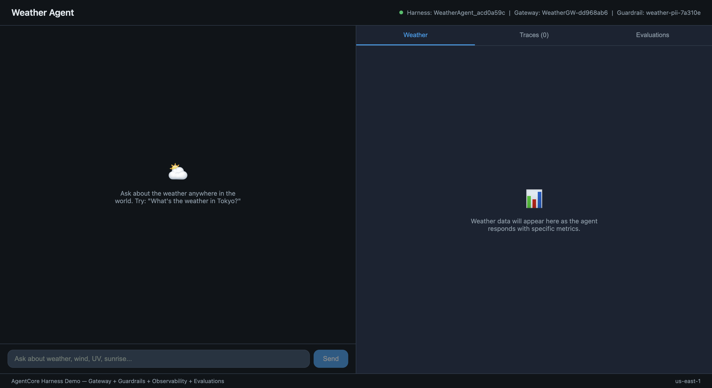

# Weather Agent — Harness + Evaluations + Gateway + Observability



| Information         | Details                                                                    |
|:--------------------|:---------------------------------------------------------------------------|
| Tutorial type       | Use Case                                                                   |
| Agent type          | Weather assistant with multi-tool capabilities                             |
| Agentic Framework   | None (direct boto3)                                                        |
| LLM model           | Anthropic Claude Haiku 4.5                                                 |
| Tutorial components | Harness, Gateway (MCP), Guardrails (PII), Batch Evaluations, Observability |

## Overview

A full-stack weather agent web app that integrates **four AgentCore pillars** in a single demo:

1. **Gateway** — Managed proxy with an MCP target (Exa search) for tool routing and observability
2. **Guardrails** — Bedrock guardrail that anonymizes PII (email, phone, address) in agent responses
3. **Observability** — CloudWatch traces with full agent loop visibility
4. **Evaluations** — Batch evaluation scoring with built-in evaluators (Helpfulness, Correctness, Coherence, etc.)

The web app features:
- A **chat interface** where users ask weather questions
- **Weather data cards** that update in real time (temperature, wind, UV, sunrise/sunset)
- A **Traces panel** showing live trace IDs from CloudWatch (searchable in GenAI Observability)
- An **Evaluations panel** that triggers batch evaluations and displays scores

## Quick Start

```bash
./start.sh
```

One command: installs dependencies, provisions AWS resources (Gateway, Harness, Guardrail), starts the backend and frontend. Open **http://localhost:5173**.

To stop servers: `Ctrl+C`. To delete AWS resources: `./cleanup.sh`.

## Architecture

```
┌────────────────────────────────────────────────────────────────┐
│  Frontend (React + Vite) — http://localhost:5173                │
│  ┌──────────────────┐  ┌────────────────────────────────────┐ │
│  │    Chat Panel     │  │  Weather / Traces / Evaluations    │ │
│  │  (send queries)   │  │  (live cards, trace IDs, scores)   │ │
│  └────────┬──────────┘  └─────────────────┬──────────────────┘ │
└───────────┼───────────────────────────────┼────────────────────┘
            │  POST /api/chat (SSE)         │  GET /api/traces
            │                               │  POST /api/evaluate
            ▼                               ▼
┌────────────────────────────────────────────────────────────────┐
│  Backend (FastAPI) — http://localhost:8000                      │
│  ┌───────────┐ ┌────────┐ ┌─────────────┐ ┌───────────────┐  │
│  │ resources │ │ agent  │ │observability│ │  evaluation   │  │
│  │   .py     │ │  .py   │ │    .py      │ │     .py       │  │
│  └─────┬─────┘ └───┬────┘ └──────┬──────┘ └───────┬───────┘  │
└────────┼────────────┼─────────────┼────────────────┼───────────┘
         │            │             │                │
         ▼            ▼             ▼                ▼
┌────────────────────────────────────────────────────────────────┐
│  AWS (AgentCore + Bedrock + CloudWatch)                         │
│                                                                │
│  Gateway ───► Exa MCP ───► Web Search (live weather data)      │
│  Harness ───► Claude Haiku 4.5 (agent orchestration)           │
│  Guardrail ─► PII anonymization (email, phone, address)        │
│  CloudWatch ► Trace observability (GenAI Observability)         │
│  Batch Eval ► Built-in evaluators (Helpfulness, Correctness…)  │
└────────────────────────────────────────────────────────────────┘
```

## How It Works

### Web App Flow

1. **Start** — `./start.sh` provisions Gateway + Harness + Guardrail (or reuses existing ones)
2. **Chat** — User asks weather questions; agent searches via Gateway's Exa MCP target
3. **Weather Cards** — Parsed metrics (temperature, wind, UV, etc.) appear as visual cards
4. **Traces** — Each invocation generates traces visible in the Traces tab and in CloudWatch > GenAI Observability > Bedrock AgentCore > Traces
5. **Evaluations** — Click "Run Eval" to trigger a batch evaluation; results show scores for Helpfulness, Correctness, Coherence, and more (also visible in Bedrock AgentCore > Evaluations > Batch evaluation)
6. **Cleanup** — `./cleanup.sh` deletes all AWS resources including batch evaluations


## Key Features

### Gateway Integration
The Gateway acts as a managed proxy between the agent and external tool servers:
- Centralized routing for MCP tool traffic
- Automatic observability (every tool call is traced)
- Configurable auth (NONE in this demo, supports IAM/OAuth)

### Bedrock Guardrails
A guardrail anonymizes PII in agent responses. If you ask the agent to include personal info (email, phone), the guardrail masks it before the response reaches you.

### Observability
Every `invoke_harness` call automatically generates traces in CloudWatch. The Traces tab shows trace IDs that you can search in:
- **CloudWatch > GenAI Observability > Bedrock AgentCore > Traces**

### Batch Evaluations
The "Run Eval" button triggers a batch evaluation that scores your session using built-in evaluators:
- InstructionFollowing, Helpfulness, Correctness, Faithfulness, ResponseRelevance, Coherence, Conciseness, Refusal

Results appear in the web app and are also visible in:
- **Bedrock AgentCore > Evaluations > Batch evaluation**

## Prerequisites

- Python 3.10+
- Node.js 18+
- AWS CLI configured with credentials (`aws sts get-caller-identity` should work). Recommended region: **us-east-1** (`export AWS_DEFAULT_REGION=us-east-1`)
- Model access enabled for Claude Haiku 4.5 in Amazon Bedrock
- [CloudWatch Transaction Search](https://docs.aws.amazon.com/AmazonCloudWatch/latest/monitoring/CloudWatch-Transaction-Search-getting-started.html) enabled — **required** for traces and batch evaluations to work. After enabling, it may take a few minutes before traces start appearing. Only traces from invocations *after* enabling will be indexed.

## AWS Permissions Required

Your IAM user or role needs the following policies:

| Policy | Purpose |
|--------|---------|
| `BedrockAgentCoreFullAccess` | Harness, Gateway, Batch Evaluations |
| `AmazonBedrockFullAccess` | Model invocation, Guardrails |
| `IAMFullAccess` | Create the harness execution role (first run only) |
| `CloudWatchFullAccessV2` | Query traces + batch evaluation output logs |

## Running

### Web App (recommended)

```bash
./start.sh
```

One command: creates a virtual environment, installs Python and Node.js packages, provisions AWS resources, starts the FastAPI backend and React frontend.

Open **http://localhost:5173** once the script prints "App is running!".

```bash
# Stop servers without deleting AWS resources:
# Press Ctrl+C (resources persist for next ./start.sh)

# Stop servers AND delete all AWS resources:
./cleanup.sh
```

## Sample Prompts

- "What's the weather in Tokyo?"
- "What's the wind speed in Vancouver right now?"
- "What's the UV index in Miami today?"
- "When is sunrise and sunset in London?"

### CLI-only mode

For a headless demo that runs in the terminal and cleans up after itself. Run this separately — not while the web app is running, since both use the same AWS resources.

```bash
./run.sh
```

## Clean Up

```bash
# Delete all AWS resources (gateway, harness, guardrail, batch evaluations, IAM role):
./cleanup.sh
```